- [Setup](#setup)
- [1. Running your first container](#1-running-your-first-container)
- [2. Webapps with Docker](#2-webapps-with-docker)
  - [2.1 Run a static website in a container](#21-run-a-static-website-in-a-container)
  - [2.2 Docker Images](#22-docker-images)
  - [2.3 Create your first image](#23-create-your-first-image)
    - [2.3.1 Create a Python Flask app that displays random cat pix](#231-create-a-python-flask-app-that-displays-random-cat-pix)
    - [2.3.2 Write a Dockerfile](#232-write-a-dockerfile)
    - [2.3.3 Build the image](#233-build-the-image)
    - [2.3.4 Run your image](#234-run-your-image)
    - [2.3.5 Push your image](#235-push-your-image)

## Setup

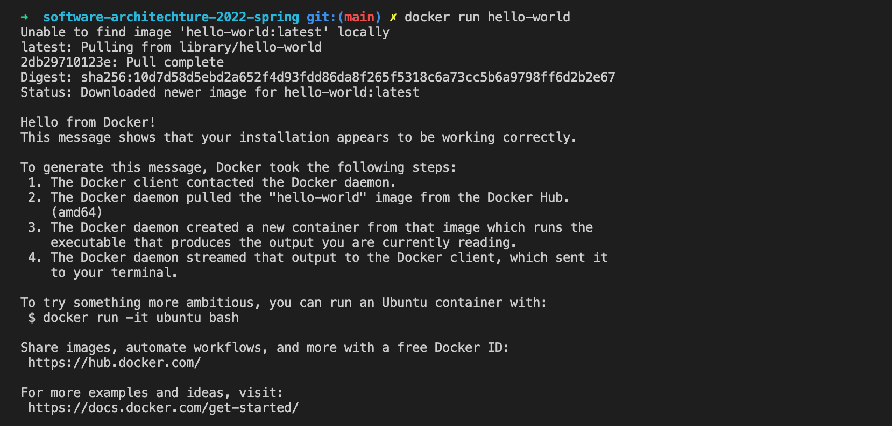

## 1. Running your first container

Pulling alpine image

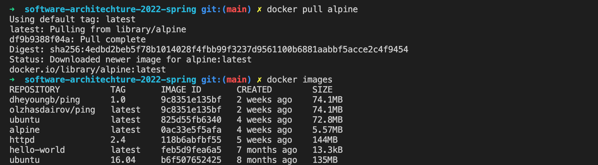

Running container and commands in it

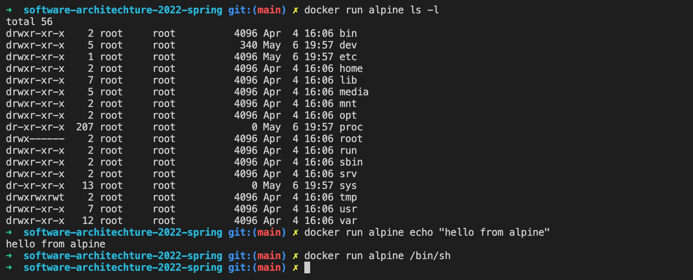

Running commands with interactive mode

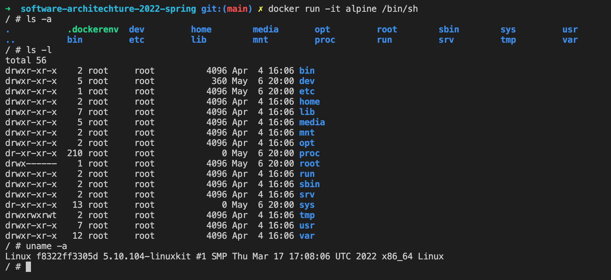

Viewing run and existing containers

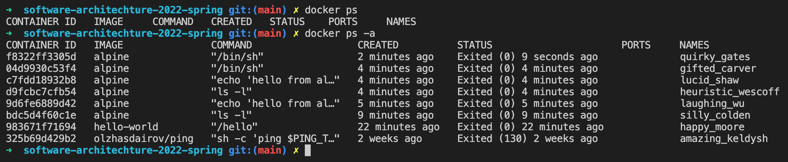

Viewing docker run command manual

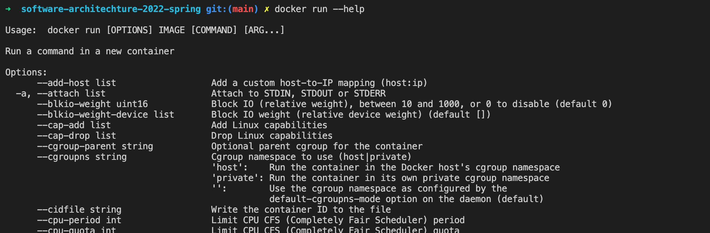

## 2. Webapps with Docker

### 2.1 Run a static website in a container

Running container in detached mode

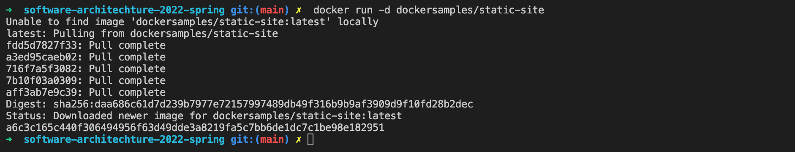

Stopping and removing container

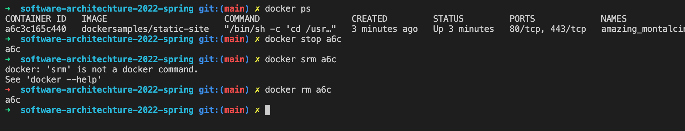

Running site in container with random port and providing environment variables

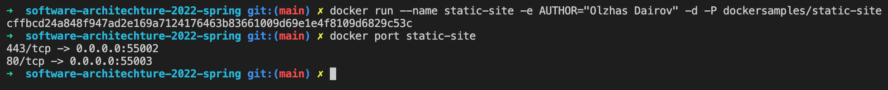
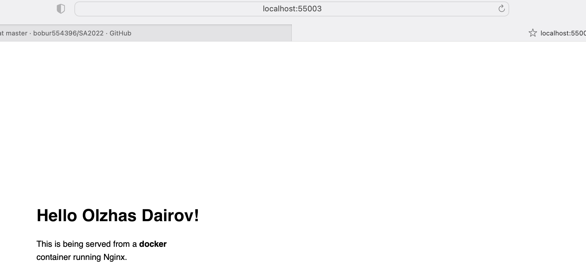

Running site with specified port

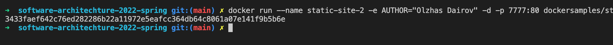
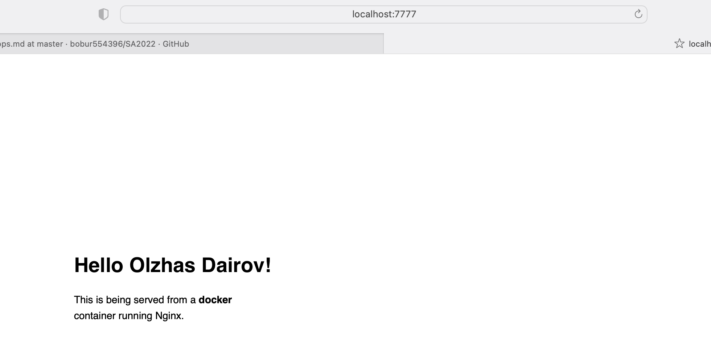

Removing created containers

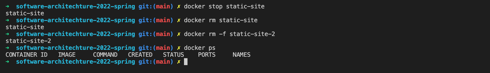

### 2.2 Docker Images

View images

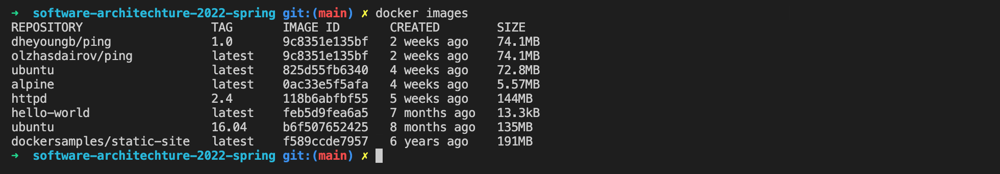

Pulling ubuntu images with/without specifying image version

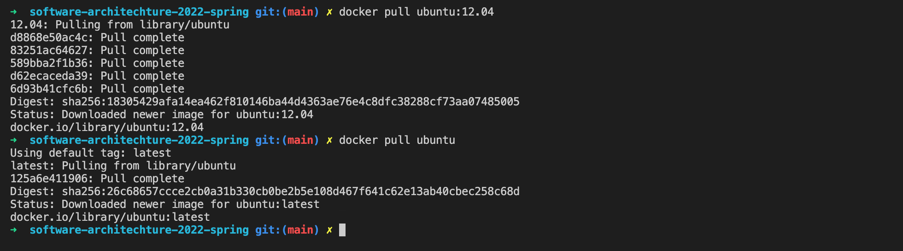

### 2.3 Create your first image

#### 2.3.1 Create a Python Flask app that displays random cat pix

[flask-app folder](flask-app/)

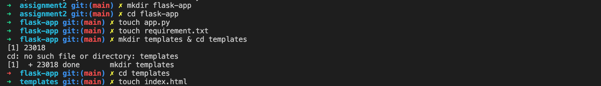

#### 2.3.2 Write a Dockerfile

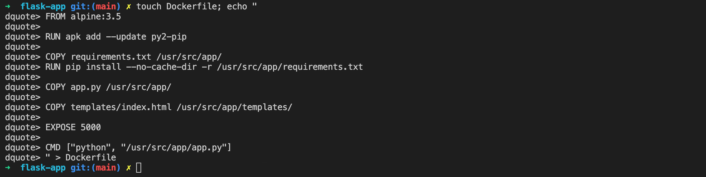

#### 2.3.3 Build the image

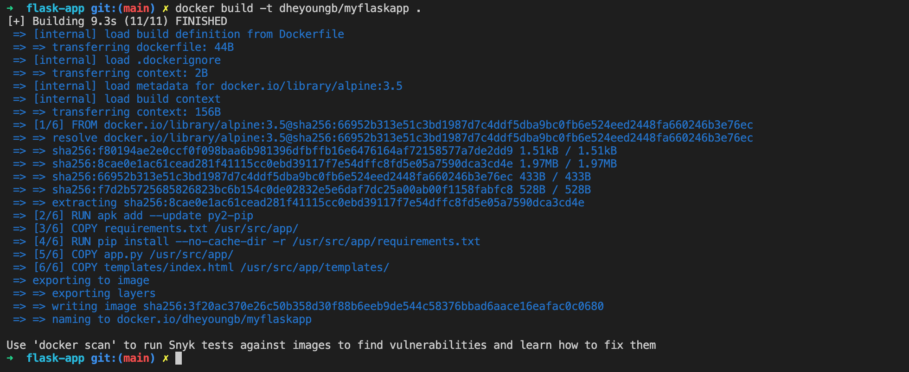

#### 2.3.4 Run your image

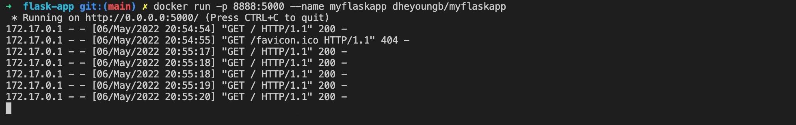
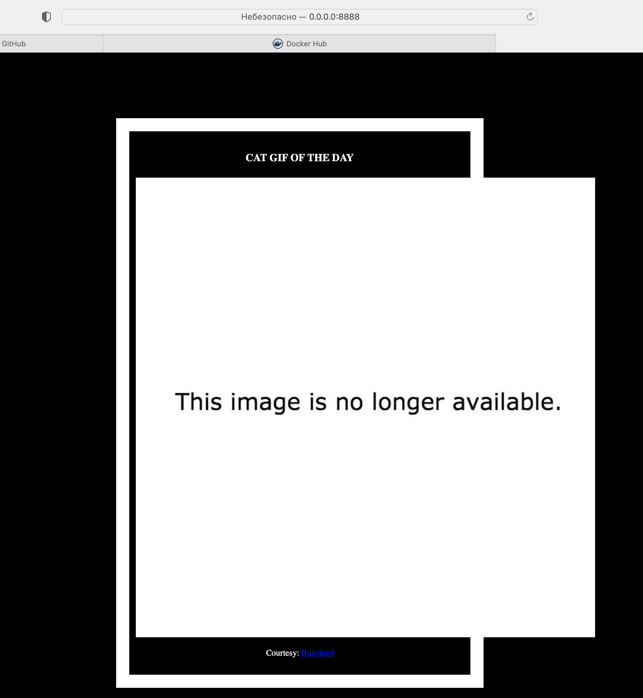

#### 2.3.5 Push your image

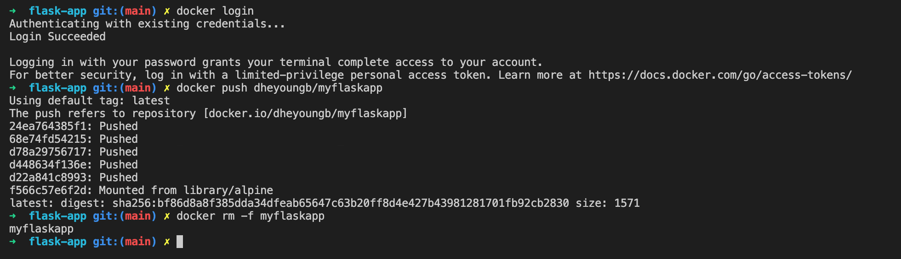
